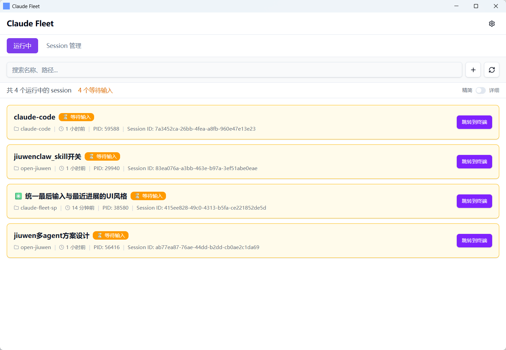
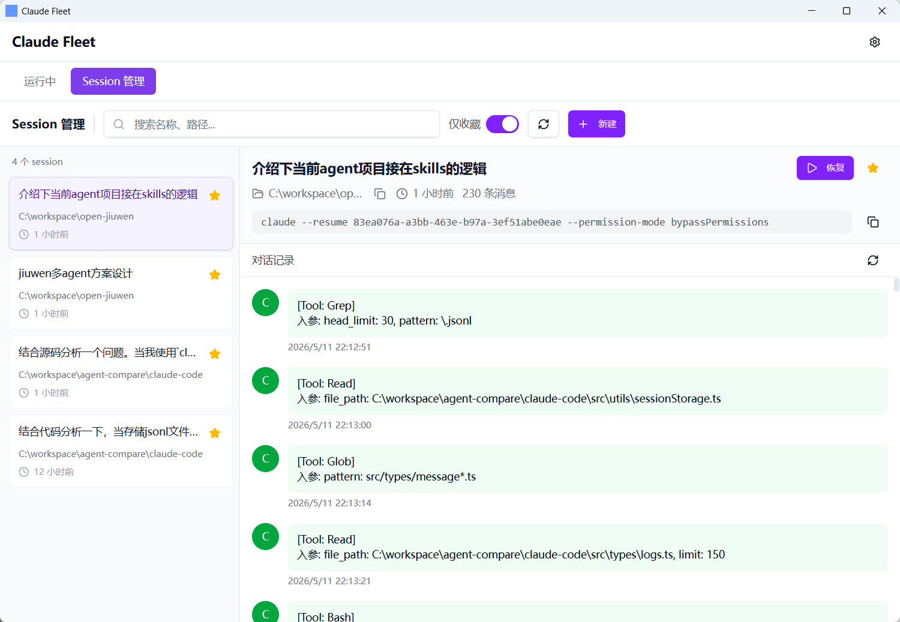
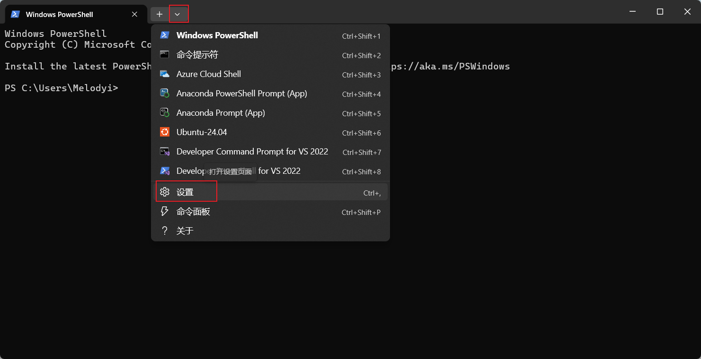
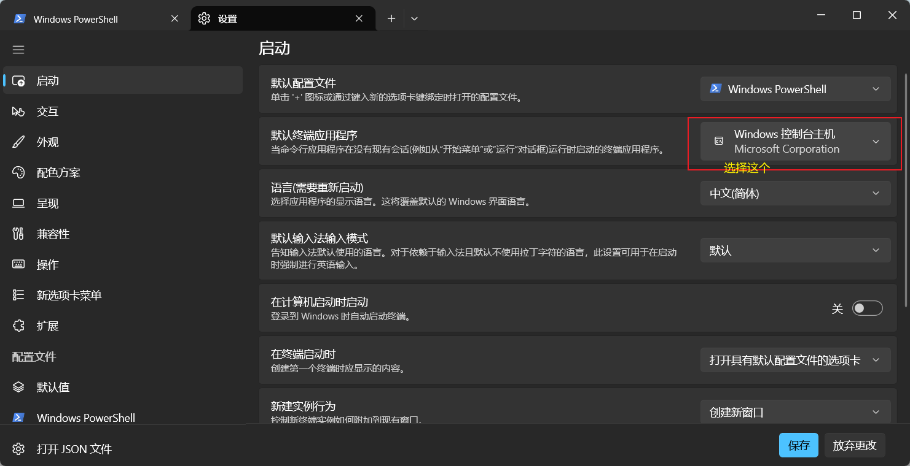
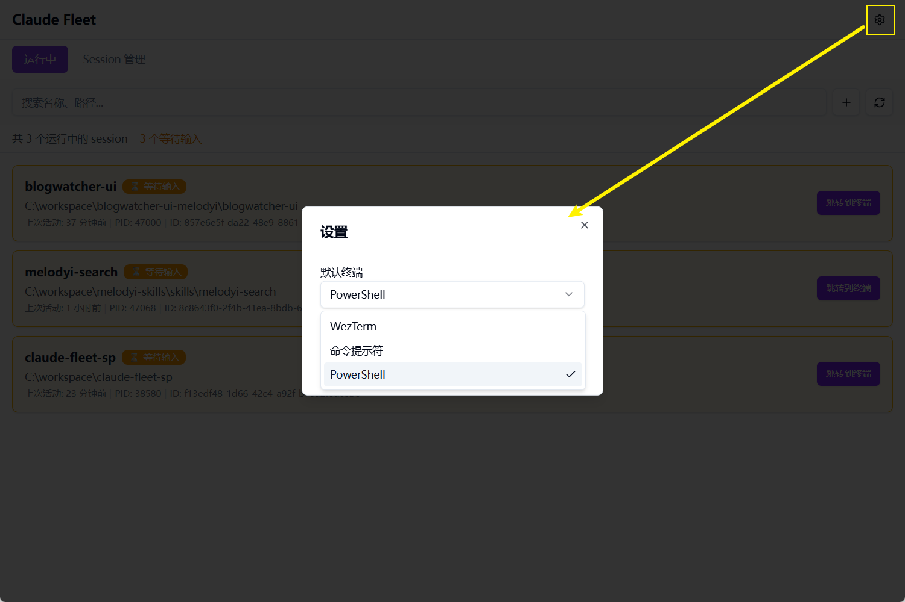
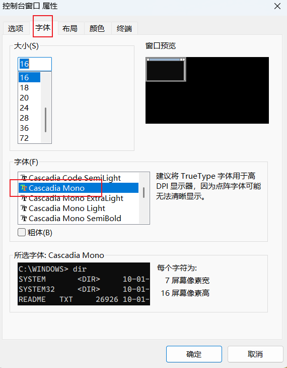

# Claude Fleet

一个管理多个 Claude Code session 的桌面应用工具。

> **声明**: 本项目借鉴了 [cc-switch](https://github.com/farion1231/cc-switch) 的设计理念和部分实现思路，在此表示感谢。

## 功能

- **实时监控**: 监控运行中的 Claude Code session 状态
  - 显示 session 状态（busy/idle/waiting）
  - 支持精简/详细模式切换
  - 显示最后输入和最近进展摘要
- **一键跳转**: 快速切换到对应的终端窗口（WezTerm、cmd、PowerShell）

- **新建 session**: 选择工作目录和终端类型，启动新的 Claude Code


- **历史管理**: 收藏、搜索、恢复历史 session
  - 搜索支持名称、路径、对话内容
  - 支持收藏过滤和时间筛选



## 安装

下载最新的安装包: [Releases](https://github.com/Melod-YI/claude-fleet/releases)

## 使用

### 使用说明

1. 关闭 windows terminal。这个工具在跳转方面有困难



目前遇到的困难是，我可以获取到 claude 进程的 pid，根据 pid 的父 pid 链找到窗口。但是 windows terminal 是个单 pid 多 tab、多窗口的程序，会在找到 pid 后无法准确找到窗口。如果不关闭 windows terminal，通过页面启动 claude code、显示运行中的 claude code 状态等能力可用，但是跳转能力不可用。

2. 在通过 Claude Fleet 的页面启动、恢复 claude code 前，先通过右上角设置按钮选择合适的终端。


对于习惯于 windows terminal 黑色背景的可以使用 cmd，但是

3. 调整终端的字体，cmd 和 powershell 的字体都需要调整下（选哪个就调整哪个），否则部分字符会乱码。
打开一个 cmd（或 powershell）后，右键顶部的窗口栏，选择"默认值"。在字体处选择 "Cascadia Mono"（windows terminal 下的默认字体），这样在显示 claude code 的 logo 的时候，不会出现乱码。（当前窗口可以关掉重开，或者右键顶部的窗口栏后选择"属性"进行修改）



### 查看运行中的 session

打开应用，默认显示"运行中" Tab，可以看到所有正在运行的 Claude Code session 及其当前状态。

### 管理历史 session

切换到"Session 管理" Tab:
- 左侧列表显示收藏和历史 session
- 支持搜索（名称、路径、对话内容）
- 支持收藏过滤和时间筛选

### 新建 session

点击 "+" 按钮，选择工作目录和终端类型，启动新的 Claude Code。

### 恢复 session

点击"恢复"按钮，自动打开新终端窗口并执行恢复命令。

### 跳转到终端

点击"跳转到终端"按钮，自动激活对应的终端窗口。

## 架构

### 前端（React + TypeScript）
- 状态管理: Zustand
- UI 组件: shadcn/ui + Tailwind CSS
- 数据请求: TanStack Query

### 后端（Rust + Tauri 2.0）
- Session 数据解析: 读取 `~/.claude/projects/` 和 `~/.claude/sessions/`
- 状态监听: 文件系统监听替代轮询
- 窗口管理: Windows API 终端窗口匹配

### 数据流
1. Claude Code 数据存储在 `~/.claude/` 目录
2. Tauri 文件监听器监听 `sessions/` 目录变化
3. 前端通过 Tauri invoke 和事件接收状态更新

## 开发

```bash
# 安装依赖
npm install

# 开发模式
npm run tauri dev

# 构建
npm run tauri build
```

### 开启 DEBUG 日志

默认日志级别为 INFO，开启 DEBUG 日志可查看更详细的执行过程：

**方法一：设置环境变量**
```bash
# Windows PowerShell
$env:RUST_LOG = "debug"
npm run tauri dev

# Windows CMD
set RUST_LOG=debug && npm run tauri dev

# Linux/Mac
RUST_LOG=debug npm run tauri dev
```

**方法二：只开启本项目 DEBUG**
```bash
RUST_LOG=claude_fleet=debug npm run tauri dev
```

**日志文件位置：**
- `%USERPROFILE%\.claude-fleet\logs\claude-fleet-YYYY-MM-DD.log`

## 技术栈

- Tauri 2.0
- React 18
- TypeScript 5
- Tailwind CSS 4
- shadcn/ui
- Zustand
- TanStack Query

## 致谢

本项目的以下设计借鉴了 [cc-switch](https://github.com/farion1231/cc-switch):
- Session 数据结构设计
- JSONL 文件解析逻辑
- Session 元数据提取方法

感谢 cc-switch 开源社区的贡献。

## License

MIT License